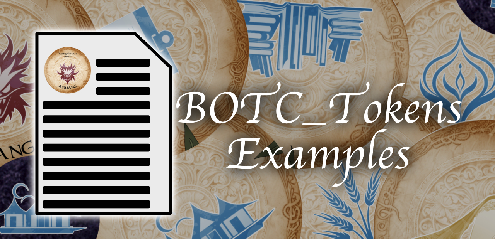

# Examples
The [full_example](full_example) directory contains, unsurprisingly, a full example of how to use the BOTC_Tokens utility, along
with a walkthrough guide of how it was created. Start there if you're new to the utility and want to see what it can do,
or if you're looking for a starting point for your own project.
 
# Packages
This repo also contains a number of component packages that can be used to alter the look of the tokens the utility
generates. You can use them directly or as a starting point for your own experimentation. Check out the 
[component_packs](component_packs) directory for a list of available ones along with previews of what they look like.