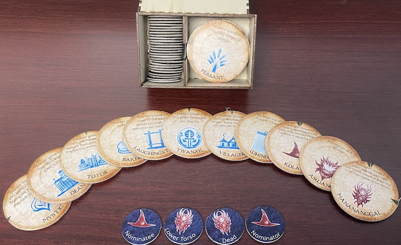

# Full Example
This example was created from scratch using affinity designer to create the icons and the botc_tokens utility to create
the token images. This particular script is mostly in-jokes from my own play group, so I wouldn't advise using them in 
an actual game. Still, you are welcome to adapt or use any of them outright, and they demonstrate what you can expect 
when using the utility with your own roles. 



## Creating Components
To begin, we will create our components directory. The utility can be used to create a directory with all the default 
assets via the following command:

```bash
botc_tokens dump-components components
```

This will create a directory named `components` with all the images and font files that go into making the tokens. 
For this example, we won't modify anything, but if you do wish to customize the assets, you can do so by replacing the
files in the `components` directory with your own. Make sure to keep the same file names and file types so that the
utility can find them. Additionally, it is important to make sure all the token images components 
(leaves, flowers, backgrounds, etc.) are the same dimensions. The utility makes this assumption, and the results will
be unpredictable if it is not met.

## Creating Roles
Next, we will create our roles. To start, we create the structure of our input directory. For this example, we will be 
using the default values for all the directories, so our input directory will be unimaginatively named `inputs`. 
Once created, it should look something like this:

```
inputs
├── 99 - Homebrew
│ ├── demon
│ ├── fabled
│ ├── minion
│ ├── outsider
│ └── townsfolk
```

This structure isn't strictly necessary, but it is a good way to organize your roles. The utility will read all json
files in the `inputs` directory and its subdirectories, though, so you can organize your roles however you like.

With the directory structure in place, it is time to start populating it with roles. For each role you would like to 
add, create a json file with the following structure (minus the comments, of course) in the appropriate folder:

```JSON
{
  "name": "Example Role",                 // The name that will be below the icon on the token.
  "ability": "You are an example role.",  // This ability text will show up above the icon.
  "type": "townsfolk",                    // Specifies the subdirectory in home_script that the token will be saved in.
  "icon": "example_icon.png",             // A relative path to the image file that will be used as the icon.
  "first_night": false,                   // Does this role wake up on the first night?
  "other_nights": false,                  // Does this role wake up on other nights?
  "reminders": ["FIRST", "SECOND"],       // Reminder token text associated with this role.
  "affects_setup": false,                 // Does this role affect the setup of the game?
  "home_script": "99 - Homebrew"          // The subdirectory that the token will be saved in.
}
```

Remember to place your icon image correctly relative to the json file that references it. In this example, we put 
the icon in the same directory as the json file, but you can put it anywhere you like as long as the path is correct.


## Generating Tokens
With our roles in place, we can now generate our tokens. The utility can take care of it from here. 
To do so, we will use the following command:

```bash
botc_tokens create inputs --output-dir tokens --components components --role-diameter 575 --reminder-diameter 325
```

Incidentally, since we are using all the default values, this command could have be shortened to `botc_tokens create`,
but since this is an example, we try to be more verbose.

Once the command is run, the utility should have created a directory named `tokens` in which we can find all the tokens
for our custom script.

## Creating Printables
Now with all the tokens generated, it is time to group them onto a printable sheet to make is easier to create them.
There are two ways of doing this: from a **directory** and from a **script**.

### Creating from a directory
The first is to pass the entire token directory to the utility, and it will group
all the tokens into printable sheets. This is done like so:

```bash
botc_tokens group tokens --output-dir printables --fixed-role-size 575 --fixed-reminder-size 325 --padding 0 --paper-width 2402 --paper-height 3152
```

Again, since we are using all the default values, this command could have been shortened to `botc_tokens group tokens`.

### Creating from a script
Perhaps, however, we don't want to use all the tokens we generated? In that case, we can create a script that specifies
exactly which tokens we want to use. This script follows the format of the 
[official script tool](https://script.bloodontheclocktower.com/), namely that it is just a json file with a single list
containing the names of the roles we want to use. For details, see [example_script.json](example_script.json). In this 
example, we have created a script that excludes the fabled roles. To build a printable for this script, we can run 
the command like this:

```bash
botc_tokens group example_script.json --output-dir script_printables
```

This should create the same printable sheets as before, but with only the roles specified in the script.

## Finishing Up
And that's it! We have created our tokens and printables, so all that is left now is to print them out, add the felt and
chipboard, and punch them out. We hope that this example has been helpful, and we look forward to seeing what you 
create!